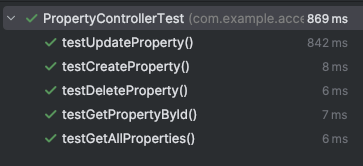

# CRUD Property Management System (Spring Boot and MySQL)

This project is a basic property management system built with Spring Boot, JPA, and MySQL. It enables users to perform CRUD operations (Create, Read, Update, Delete) on property records. The properties are saved in a MySQL database, and the application provides a REST API for interaction.

### Explanation:

#### PropertyServiceTest:

- Simulates interactions with `PropertyRepository` to ensure the service methods are invoked and return the expected outcomes.
- Tests the primary methods: create, read, update, and delete.

#### PropertyControllerTest:

- Utilizes `MockMvc` to mimic HTTP requests to the controller's endpoints.
- Checks the HTTP responses, status codes (like `200 OK`), and the returned JSON data.
- Tests include creating, retrieving all properties, retrieving by ID, updating, and deleting properties.

## Getting Started

### Prerequisites

You need to install the following tools and configure their dependencies:

1. **Java** (version 8 or above)

    ```bash
    java -version
    ```

   It will look something like this:

    ```bash
    java version "1.8.0"
    Java(TM) SE Runtime Environment (build 1.8.0-b132)
    Java HotSpot(TM) 64-Bit Server VM (build 25.0-b70, mixed mode)
    ```

2. **Maven**
    - Download Maven from [here](http://maven.apache.org/download.cgi)
    - Follow the installation instructions [here](https://maven.apache.org/install.html)

   Verify the installation:

    ```bash
    mvn -version
    ```

   Should return something like:

    ```bash
    Apache Maven 3.6.3
    ```

3. **Docker**
    - Install Docker by following the instructions [here](https://docs.docker.com/get-docker/)
    - Verify the installation:

    ```bash
    docker --version
    ```

   Should return something like:

    ```bash
    Docker version 20.10.7, build f0df350
    ```

## Installing

1. Clone the repository and navigate into the project directory:

    ```bash
    git clone https://github.com/Hajaku12/CRUD-System-to-Management.git
    cd CRUD-System-to-Management
    ```

2. Build the project:

    ```bash
    mvn clean package
    ```

## Running the Application

1. Start the MySQL service using Docker Compose:

    ```bash
    docker-compose up -d
    ```

   The MySQL container will be created and running as defined in the `docker-compose.yml` file.

2. Update your `application.properties` with the following configuration to connect to the MySQL container:

    ```properties
    spring.application.name=JPA
    spring.datasource.url=jdbc:mysql://localhost:3000/mydatabase
    spring.datasource.username=user
    spring.datasource.password=P@ssword1
    spring.datasource.driver-class-name=com.mysql.cj.jdbc.Driver
    spring.jpa.hibernate.ddl-auto=update
    spring.jpa.show-sql=true
    spring.jpa.database-platform=org.hibernate.dialect.MySQLDialect

    ```
3. Run the application:

    ```bash
    java -jar target/accessing-data-jpa-initial-0.0.1-SNAPSHOT.jar
    ```

4. Access the API at: `http://localhost:8080/index.html`

[Video_LocalHost.mov](video%2FVideo_LocalHost.mov)

## Test Resutls

To run the tests use:

  ```bash
  mvn test
  ```



## Deployment in AWS

1. Access the ServerSQL instance and install the package repository.


2. Import the MySQL GPG key manually:

    ```bash
    sudo rpm --import https://repo.mysql.com/RPM-GPG-KEY-mysql-2022
    ```

3. Install MySQL:

    ```bash
    sudo yum install mysql-community-server -y
    ```

4. Retrieve the root password:

    ```bash
    sudo cat /var/log/mysqld.log | grep 'temporary password'
    ```

5. Log in with the retrieved password and change it:

    ```bash
    sudo mysql -u root
    ```

    ```bash
    ALTER USER 'root'@'localhost' IDENTIFIED BY 'NewSecurePassword';
    ```

6. Create a new user and grant privileges:

    ```bash
    CREATE USER 'user'@'%' IDENTIFIED BY 'your_password';
    ```

    ```bash
    GRANT ALL PRIVILEGES ON *.* TO 'user'@'%' WITH GRANT OPTION;
    ```

    ```bash
    FLUSH PRIVILEGES;
    ```

7. Create the database:

    ```bash
    CREATE DATABASE mydatabase;
    ```


8. Edit the MySQL configuration file to allow remote connections:

    ```bash
    sudo nano /usr/bin/etc/my.cnf
    ```

    ```bash
    bind-address = 0.0.0.0
    ```


9. Make the necessary code changes.

  ```properties
spring.application.name=JPA
spring.datasource.url=jdbc:mysql://54.221.172.31:3306/mydatabase
spring.datasource.username=user
spring.datasource.password=P@ssword1
spring.datasource.driver-class-name=com.mysql.cj.jdbc.Driver
spring.jpa.hibernate.ddl-auto=update
spring.jpa.show-sql=true
spring.jpa.database-platform=org.hibernate.dialect.MySQLDialect
  ```


10. Upload the project's .jar file to the AWS instance:

    ```bash
    scp -i "key.pem" target/accessing-data-jpa-initial-0.0.1-SNAPSHOT.jar ec2-user@
    ```
11. Install Java:

    ```bash
    sudo yum install java-17-amazon-corretto -y
    ```

12. Run the project:

    ```bash
    java -jar target/accessing-data-jpa-initial-0.0.1-SNAPSHOT.jar
    ```

    Access the project at:

    ```bash
    http://18.207.198.219:8080/
    ```

[Video_Desploy.mov](video%2FVideo_Desploy.mov)


## Diagram Class


## Class Diagram Explanation

This diagram shows the structure of the Property Management System and the relationships between the main classes in the backend.

### Classes:

1. **Property**:
   - Represents a property with attributes like `id`, `address`, `price`, `size`, and `description`.
   - Methods:
      - `getId()`: Returns the property ID.
      - `getAddress()`: Returns the property address.
      - `getPrice()`: Returns the property price.
      - `getSize()`: Returns the property size.
      - `getDescription()`: Returns the property description.

2. **PropertyController**:
   - Handles HTTP requests for managing properties.
   - Dependencies:
      - Injects `PropertyService` for business logic.
   - Methods:
      - `createProperty(Property property)`: Creates a new property.
      - `getAllProperties()`: Retrieves all properties.
      - `getPropertyById(Long id)`: Retrieves a property by ID.
      - `updateProperty(Long id, Property propertyDetails)`: Updates a property by ID.
      - `deleteProperty(Long id)`: Deletes a property by ID.

3. **PropertyService**:
   - Implements business logic.
   - Dependencies:
      - Injects `PropertyRepository` for database interactions.
   - Methods:
      - `createProperty(Property property)`: Creates a new property.
      - `getAllProperties()`: Returns all properties.
      - `getPropertyById(Long id)`: Retrieves a property by ID.
      - `updateProperty(Long id, Property propertyDetails)`: Updates a property.
      - `deleteProperty(Long id)`: Deletes a property.

4. **PropertyRepository**:
   - Interface for data persistence, extends `JpaRepository`.
   - Methods:
      - `findByAddress(String address)`: Searches for properties by address.


## Architecture


### Diagram Explanation

This diagram illustrates the architecture of the Property Management System, including the frontend and backend components.

### Components:

1. **Frontend**:
   - **User Interface**:
      - Provides a web interface for users to interact with the system.
      - Sends HTTP requests to the backend API.
   - **API Client**:
      - Communicates with the backend API to perform CRUD operations on properties.
      - Sends requests like `GET`, `POST`, `PUT`, and `DELETE` to the backend.

2. **Backend**:
    - **Controller**:
        - Handles HTTP requests from the frontend.
        - Routes requests to the appropriate service methods.
    - **Service**:
        - Implements business logic for managing properties.
        - Interacts with the repository for data access.
    - **Repository**:
        - Provides an interface for data persistence.
        - Extends `JpaRepository` to perform CRUD operations on properties.
    - **Database**:
        - Stores property records in a MySQL database.
        - Tables include fields like `id`, `address`, `price`, `size`, and `description`.

3. **Deployment**:
    - **Localhost**:
        - Runs the application locally during development and testing.
        - Uses Docker Compose to start the MySQL container
    - **AWS**:
    - **ServerSQL**:
        - Hosts the MySQL database for storing property records.
        - Configured to allow remote connections from the backend application.


## Built With

- [Maven](https://maven.apache.org/) - Dependency Management
- [Spring Boot](https://spring.io/projects/spring-boot) - Framework for building microservices
- [Docker](https://www.docker.com/) - Containerization
- [MySQL](https://www.mysql.com/) - Relational Database

## Generating Project Documentation

1. **Generate the Site**
    - Run the following command to generate the site documentation:
      ```sh
      mvn site
      ```

2. **Add Javadoc Plugin for Documentation**
    - Add the Javadoc plugin to the `reporting` section of the `pom.xml`:
      ```xml
      <project>
        ...
        <reporting>
          <plugins>
            <plugin>
              <groupId>org.apache.maven.plugins</groupId>
              <artifactId>maven-javadoc-plugin</artifactId>
              <version>2.10.1</version>
              <configuration>
                ...
              </configuration>
            </plugin>
          </plugins>
        </reporting>
        ...
      </project>
      ```

    - To generate Javadoc as an independent element, add the plugin in the `build` section of the `pom.xml`:
      ```xml
      <project>
        ...
        <build>
          <plugins>
            <plugin>
              <groupId>org.apache.maven.plugins</groupId>
              <artifactId>maven-javadoc-plugin</artifactId>
              <version>2.10.1</version>
              <configuration>
                ...
              </configuration>
            </plugin>
          </plugins>
        </build>
        ...
      </project>
      ```

3. **Generate Javadoc Commands**
    - Use the following commands to generate Javadocs:
      ```sh
      mvn javadoc:javadoc
      mvn javadoc:jar
      mvn javadoc:aggregate
      mvn javadoc:aggregate-jar
      mvn javadoc:test-javadoc
      mvn javadoc:test-jar
      mvn javadoc:test-aggregate
      mvn javadoc:test-aggregate-jar
      ```

## License
This project is licensed under the MIT License - see the `LICENSE.txt` file for details.

## Versioned

We use [Git](https://github.com/) for version control. For available versions, see the tags in this repository.

## Author

- **Hann Jang** - 

